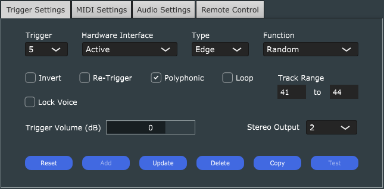
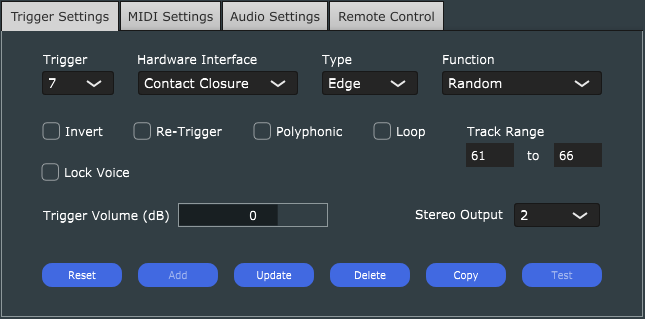
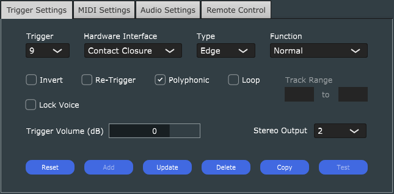
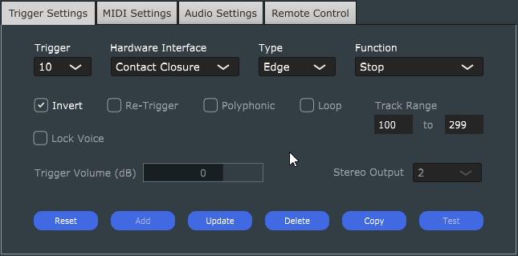

# WAV Trigger Configuration Documentation

## Overview
This document provides visual documentation of the WAV Trigger configuration for the Chicago Coin Playboy pinball machine. Each section includes screenshots and descriptions of the trigger settings.

## Configuration Settings Reference

### Hardware Interface Options
- **Contact Closure**: Used for physical buttons/switches (active when connected to ground)
- **Active - 3.3V/5V**: Used for active devices like microcontrollers (active when connected to high signal)

### Trigger Type Options
- **Edge Triggered**: Starts track when trigger first goes active, continues until stopped
- **Level Triggered**: Track plays only while trigger remains active

### Function Options
- **Normal**: Plays corresponding track number
- **Next**: Plays next track in range, wraps around
- **Previous**: Plays previous track in range, wraps around
- **Random**: Plays random track from range (no repeats)
- **Pause**: Pauses all tracks in range
- **Resume**: Resumes paused tracks in range
- **Stop**: Stops all tracks in range
- **Volume Up/Down**: Controls output volume (±1dB per trigger)

### Additional Options
- **Invert**: Inverts trigger logic (active high vs active low)
- **Re-Triggers**: Allows immediate re-triggering while track is playing
- **Polyphonic**: Allows mixing with other playing tracks

## Music Triggers

### Primary Music (Trigger 1)

- Hardware Interface: Contact Closure
- Type: Edge Triggered
- Function: Random
- Track Range: 101-199
- Volume: -10 dB
- Invert: No
- Re-Triggers: Yes
- Polyphonic: No

### Secondary Music (Trigger 2)

- Hardware Interface: Contact Closure
- Type: Edge Triggered
- Function: Random
- Track Range: 201-299
- Volume: -10 dB
- Invert: No
- Re-Triggers: Yes
- Polyphonic: No

## Kickout Sounds

### Kickout 1 (Trigger 3)

- Hardware Interface: Active 3.3V/5V
- Type: Edge Triggered
- Function: Random
- Track Range: 21-29
- Volume: 0 dB
- Invert: No
- Re-Triggers: Yes
- Polyphonic: Yes

### Kickout 2 (Trigger 4)

- Hardware Interface: Active 3.3V/5V
- Type: Edge Triggered
- Function: Random
- Track Range: 31-39
- Volume: 0 dB
- Invert: No
- Re-Triggers: Yes
- Polyphonic: Yes

## Rollover Sounds

### Rollover 1 (Trigger 5)

- Hardware Interface: Active 3.3V/5V
- Type: Edge Triggered
- Function: Random
- Track Range: 41-44
- Volume: 0 dB
- Invert: No
- Re-Triggers: Yes
- Polyphonic: Yes

### Rollover 2 (Trigger 6)

- Hardware Interface: Active 3.3V/5V
- Type: Edge Triggered
- Function: Random
- Track Range: 51-53
- Volume: 0 dB
- Invert: No
- Re-Triggers: Yes
- Polyphonic: Yes

## Tilt Sounds

### Tilt 1 (Trigger 7)

- Hardware Interface: Contact Closure
- Type: Edge Triggered
- Function: Random
- Track Range: 61-66
- Volume: 0 dB
- Invert: No
- Re-Triggers: No
- Polyphonic: No

### Tilt 2 (Trigger 8)

- Hardware Interface: Contact Closure
- Type: Edge Triggered
- Function: Random
- Track Range: 71-73
- Volume: 0 dB
- Invert: No
- Re-Triggers: No
- Polyphonic: No

## Special Buttons

### Info Button (Trigger 9)

- Hardware Interface: Contact Closure
- Type: Edge Triggered
- Function: Normal
- Track Range: Not specified
- Volume: 0 dB
- Invert: No
- Re-Triggers: Yes
- Polyphonic: No

### Quiet Button (Trigger 10)

- Hardware Interface: Contact Closure
- Type: Level Triggered
- Function: Stop
- Track Range: 100-299
- Volume: 0 dB
- Invert: Yes
- Re-Triggers: No
- Polyphonic: No

## Score Bell Sounds

### Score Bell 1 (Trigger 11)

- Hardware Interface: Contact Closure
- Type: Edge Triggered
- Function: Normal
- Track Range: Not specified
- Volume: 0 dB
- Invert: No
- Re-Triggers: Yes
- Polyphonic: Yes

### Score Bell 2 (Trigger 12)

- Hardware Interface: Contact Closure
- Type: Edge Triggered
- Function: Normal
- Track Range: Not specified
- Volume: 0 dB
- Invert: No
- Re-Triggers: Yes
- Polyphonic: Yes

## .ini File Format Reference

The WAV Trigger configuration is stored in a .ini file with the following format:

```
#TRIG NN, A, B, C, D, E, F, G, H, I
```

Where:
- `NN` = Trigger number (01-12)
- `A` = Hardware Interface (1=Contact Closure, 2=Active 3.3V/5V)
- `B` = Invert (0=No, 1=Yes)
- `C` = Type (0=Edge Triggered, 1=Level Triggered)
- `D` = Re-Triggers (0=No, 1=Yes)
- `E` = Polyphonic (0=No, 1=Yes)
- `F` = Function (1=Normal, 4=Random, 7=Stop)
- `G` = Volume (in dB)
- `H` = Low track number
- `I` = High track number

Example:
```
#TRIG 01, 1, 0, 1, 1, 0, 4, -10, 101, 199
```
This translates to:
- Trigger 1
- Contact Closure interface
- Not inverted
- Edge Triggered
- Re-Triggers enabled
- Not polyphonic
- Random function
- Volume at -10 dB
- Track range 101-199 